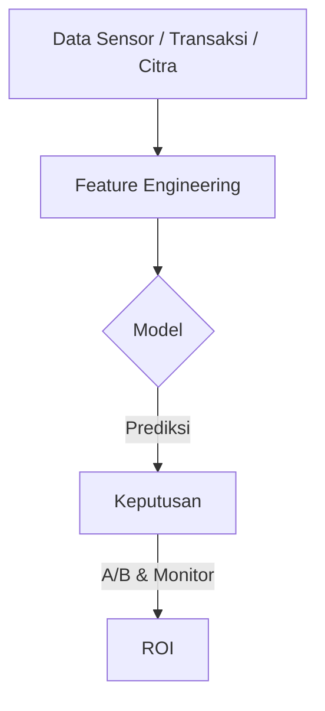
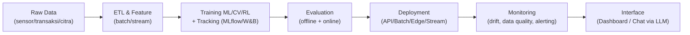

---
# a clean, bold look
theme: seriph
colorSchema: auto
background: https://images.unsplash.com/photo-1518779578993-ec3579fee39f?q=80&w=1974&auto=format&fit=crop
class: text-center
transition: slide-left
mdc: true
fonts:
  sans: Inter
  mono: Fira Code
title: AI for Industries — Beyond LLM
info: |
  Practical, non-LLM AI that drives business outcomes. With demos and architecture patterns.
---

# AI for Industries 


Rezki Nasrullah · AI & Software Engineering

@rezki.dev

<div class="abs-br m-6 text-xl opacity-70">
  Press → to begin
</div>

<!--
Notes
- Opening: AI jauh lebih luas dari chatbot. Fokus dampak bisnis.
- Janji: contoh konkret + demo singkat.
-->

---
layout: image-right
image: https://images.unsplash.com/photo-1581091226825-a6a2a5aee158?q=80&w=1935&auto=format&fit=crop
class: text-left
---

# Big Idea

<span class="text-5xl font-700">AI ≠ ChatGPT</span>

Di industri, AI adalah sistem yang **belajar dari data** untuk membantu keputusan.

- Mengurangi downtime mesin
- Mengoptimalkan stok & logistik
- Mendeteksi fraud & anomali
- Mempercepat diagnosa visual
- Membuat laporan otomatis

Notes:
- Align with business outcomes first; tools later.

---
layout: two-cols
layoutClass: gap-8 items-center
transition: slide-up
---

# Agenda

1. Landscape: AI di luar LLM
2. Use cases lintas industri
3. Lightning demos (tabular, vision, forecasting)
4. LLM sebagai interface
5. Arsitektur modern + praktik implementasi
6. Mitos vs Fakta + langkah awal

---

# Landscape AI (ringkas)

```txt {monaco}
Artificial Intelligence
├─ Machine Learning (tabular, time-series)
│  ├─ Supervised (regresi/klasifikasi)
│  ├─ Unsupervised (clustering)
│  └─ Reinforcement Learning
├─ Computer Vision (deteksi objek, OCR, inspeksi)
├─ Natural Language Processing (NLP)
│  └─ LLM (ChatGPT, Claude, dsb)
└─ Generative AI (gambar, audio, video)
```

<v-click>
<div class="mt-6 text-xl">
LLM adalah subset NLP — alat bantu penjelas & interface, bukan pengganti semua model.
</div>
</v-click>

---
layout: two-cols
layoutClass: gap-10
---

# Peta Manfaat Industri

- Manufaktur: Predictive Maintenance → kurangi downtime
- Retail: Forecast Demand → efisiensi stok & promo yang tepat
- Healthcare: Image Diagnosis → triase lebih cepat
- Finance: Fraud Detection → cegah transaksi curang
- Transportasi: Route Optimization → hemat biaya & waktu

::right::



---

# Klasifikasi menurut tujuan

- Descriptive: apa yang terjadi
- Predictive: apa yang akan terjadi
- Prescriptive: tindakan terbaik
- Generative: membuat konten baru


---

## Klasifikasi: Berdasarkan Metode
- **Supervised Learning** (berlabel): deteksi cacat, scoring risiko
- **Unsupervised Learning** (tanpa label): segmentasi pelanggan
- **Reinforcement Learning**: kontrol robot, optimasi kebijakan


---

## Demo 1 — Tabular: Predictive Maintenance (Non‑LLM)
**Kasus**: sensor (suhu, getaran, arus) → prediksi potensi fault.

**Goal**: klasifikasi *fault type* / *at-risk* untuk scheduling maintenance.

```python {all|1-7|9-14|16-23|all}
# Random Forest for Fault Detection
import pandas as pd
import numpy as np
from sklearn.model_selection import train_test_split
from sklearn.ensemble import RandomForestClassifier
from sklearn.metrics import classification_report, confusion_matrix
from sklearn.preprocessing import StandardScaler

# Option 1: Using UCI Steel Plates Faults dataset
try:
    from ucimlrepo import fetch_ucirepo
    steel_plates_faults = fetch_ucirepo(id=198)
    X = steel_plates_faults.data.features
    y = steel_plates_faults.data.targets['Pastry'].astype(int)  # Binary: Pastry fault
    print("✓ Loaded UCI Steel Plates Faults dataset")
except:
    # Option 2: Generate synthetic fault detection data
    print("⚠ Generating synthetic fault detection data...")
    np.random.seed(42)
    n_samples = 1941  # Similar to original
    n_features = 27
    
    # Generate features with correlations (simulating sensor readings)
    X = pd.DataFrame()
    for i in range(n_features):
        X[f'feature_{i+1}'] = np.random.randn(n_samples) * np.random.uniform(10, 100)
    
    # Create binary target with realistic class imbalance
    y = pd.Series(np.random.choice([0, 1], size=n_samples, p=[0.65, 0.35]))
    
    # Add some correlations between features and target
    for col in X.columns[:5]:
        X[col] = X[col] + y * np.random.uniform(20, 50)

print(f"\nDataset shape: {X.shape}")
print(f"Class distribution:\n{y.value_counts()}\n")

# Split data
Xtr, Xte, ytr, yte = train_test_split(X, y, test_size=0.2, random_state=42, stratify=y)

# Train Random Forest
print("Training Random Forest...")
mdl = RandomForestClassifier(
    n_estimators=200, 
    random_state=42, 
    n_jobs=-1,
    max_depth=15,
    min_samples_split=10
).fit(Xtr, ytr)

# Predictions
ypred = mdl.predict(Xte)

# Results
print("\n" + "="*60)
print("CLASSIFICATION REPORT")
print("="*60)
print(classification_report(yte, ypred))

print("\nConfusion Matrix:")
print(confusion_matrix(yte, ypred))

# Feature importance
print("\nTop 10 Most Important Features:")
importance_df = pd.DataFrame({
    'feature': X.columns,
    'importance': mdl.feature_importances_
}).sort_values('importance', ascending=False)
print(importance_df.head(10).to_string(index=False))
``
```

<small class="op60">Mulai dari baseline sederhana → iterasi fitur → kalibrasi → monitoring</small>

---

## Demo 2 — Computer Vision: Inspeksi Kualitas
**Kasus**: deteksi cacat produk (retak, gores, lubang) dari citra pabrik.

**Goal**: kurangi inspeksi manual, *early reject* otomatis.
```

```
```python {all|1-7|9-14|16-23|all}
# OpenCV Edge (baseline)
import cv2, numpy as np, urllib.request
import matplotlib.pyplot as plt

url = "https://surabaya.proxsisgroup.com/wp-content/uploads/valve.jpg"
urllib.request.urlretrieve(url, "sample.png")
img = cv2.imread("sample.png")

edges = cv2.Canny(cv2.cvtColor(img, cv2.COLOR_BGR2GRAY), 100, 200)
# Show result
plt.figure(figsize=(10, 5))
plt.subplot(1, 2, 1)
plt.imshow(cv2.cvtColor(img, cv2.COLOR_BGR2RGB))
plt.title('Original')
plt.axis('off')

plt.subplot(1, 2, 2)
plt.imshow(edges, cmap='gray')
plt.title('Edge Map (Canny)')
plt.axis('off')

plt.tight_layout()
plt.show()
``

<v-click>
<div class="mt-4 op80">Naikkan tingkat: fine-tune ResNet/YOLO + data augmentasi + active learning.</div>
</v-click>

---

## Demo 3 — Time Series Forecasting: Penjualan
**Kasus**: prediksi penjualan mingguan untuk perencanaan stok & promosi.

**Goal**: kurangi kehabisan stok / stok berlebih.

```python {all|1-6|8-16|18-24|all}
# ARIMA baseline
import pandas as pd
import matplotlib.pyplot as plt
from statsmodels.tsa.arima.model import ARIMA

url = "https://raw.githubusercontent.com/jbrownlee/Datasets/master/airline-passengers.csv"
series = pd.read_csv(url)['Passengers']

fit = ARIMA(series, order=(5,1,0)).fit()
fc = fit.forecast(steps=12)

plt.plot(series,label='history')
plt.plot(range(len(series), len(series)+12), fc, label='forecast')
plt.legend(); plt.title('12-month baseline forecast'); plt.show()
```

---
layout: two-cols
layoutClass: gap-10 items-center
---

# LLM sebagai Interface

- Menyusun laporan dari angka/plot
- Q&A atas hasil anomaly/forecast
- Natural language query untuk dashboard

::right::

```md
Anda adalah analis ritel. Jelaskan hasil forecast ke Head of Ops.
Soroti risiko kehabisan stok, reorder point, dan rencana promo.
Data: [120,133,140,160,180,175,190,200,210,205,220,230]
Output: 5 bullet, bahasa bisnis, langsung to-do.
```

<small class="op60">LLM = lapisan penjelas dan antarmuka — model inti tetap non‑LLM</small>

---
layout: image
image: /chatgpt.png
--- 
# Result 
---

# Arsitektur Modern AI di Industri



<small class="op60">Governance: versi model, keamanan data, audit trail, reproducibility</small>

---
layout: two-cols
layoutClass: gap-12
---

## Praktik Implementasi (Ringkas)
- Mulai dari **masalah bisnis** → turunkan ke metrik & data
- Gunakan **baseline sederhana** dulu (rule/ARIMA/RF)
- **Iterasi cepat**: data → fitur → model → evaluasi → deploy kecil
- **Observability**: logging, tracing, model drift, data quality
- **MLOps**: reproducibility, CI/CD, registry, monitoring

::right::

## Mitos vs Fakta
| Mitos | Fakta |
|---|---|
| AI = ChatGPT | LLM hanya subset NLP |
| AI untuk big tech saja | Banyak OSS & cloud credits |
| AI menggantikan manusia | AI memperkuat keputusan manusia |
| Harus deep learning dulu | Seringnya baseline klasik sudah ROI |

---
layout: center
class: text-center
---

# Quickstart Colab


---
layout: center
---

## Takeaways
- **AI lebih luas dari LLM**: tabular, vision, time-series, RL, optimization
- Mulai dengan **baseline yang masuk akal** dan data yang ada
- Gunakan **LLM sebagai antarmuka/penjelas**, bukan satu-satunya solusi

---
layout: center
class: text-center
---

## **Terima kasih**

## Q&A
